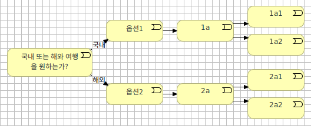

# 챗봇 디자인

> 참고문헌: VOICEBOT AND CHATBOT DESIGN (레이첼 배티시 저)

## CUI (Conversational User Interface)
> '자연스러운 인간의 대화'를 모방하는 컴퓨터와 상호 작용하는 새로운 방식 

### 인간-머신 간 상호 작용 발전 순서

1. 텍스트 기반 인터페이스
1. GUI (Graphic User Interface)
1. CUI
1. 음성 기반 CUI

### CUI 스택

* 음성 인식 (보이스봇)
  * STT (Speech-To-Text)
* NLU (Natural Language Understanding, 자연어 이해)
  * 독해 작업
  * 사용자 의도 파악
* 대화 수준
  * 사전/샘플
    * 주제 영역 또는 도메인 개념과 카테고리에 공범위하고 포괄적인 샘플 세트 제공
    * 각 의도(요청)에 연결되는 문장의 모음 제공
      
        | 사용자 요청(샘플) | 관련된 의도 |
        | --- | --- |
        | 여행을 예약하고 싶다. | 항공편 예약 |
        | 비행기를 예약하고 싶다. | 항공편 예약 |
        | 비행기가 필요하다. | 항공편 예약 |
        | 호텔 방을 예약해주세요. | 숙소 예약 |
        | 숙소가 필요하다. | 숙소 예약 |
      
  * 컨텍스트 (상황 인식)
    * 상황 인식이 가능하다는 것은 봇과의 상호 작용이 인간화됐다는 것을 의미
      * 상태 머신
        * 사용자의 반응에 따라 대화의 각 상태를 다은 단계로 연결 
        * 단순한 use case는 구축이 쉬우나 복잡한 use case에는 사용 불가
          
          
          
      * 이벤트 기반 상황 인식 접근법
        * CUI에 적합한 방법
        * 전체 대화 흐름을 매핑하는 것이 불가능하다는 점을 인식해 다른 옵션을 최소화하고 구조화하지 않은 방식으로 사용자 요구 상황에 맞는 정보를 수집
          * 필요 정보
            * 출발자
            * 목적지
            * 출발일
            * 항공사
          
            | 사용자 요청 | 봇 정보 수집 | 봇 정보 요청 | 사용자 답변 |
            | --- | --- | --- | --- |
            | 제주도 가는 항공편을 예약하고 싶다. | 목적지: 제주도 | 출발지  출발일  항공사 | 서울  내일  대한항공 |
            | 내일 서울에서 제주도로 가고 싶다. | 출발: 서울  목적지: 제주도  출발일: 내일 | 항공사 | 대한항공 |
            | 대한항공으로 제주도에 가고 싶다. | 목적지: 제주도  항공사: 대한항공 | 출발지  출발일 | 서울  내일 |
      
  * 비즈니스 로직 