# 설계 

## 구성요소 

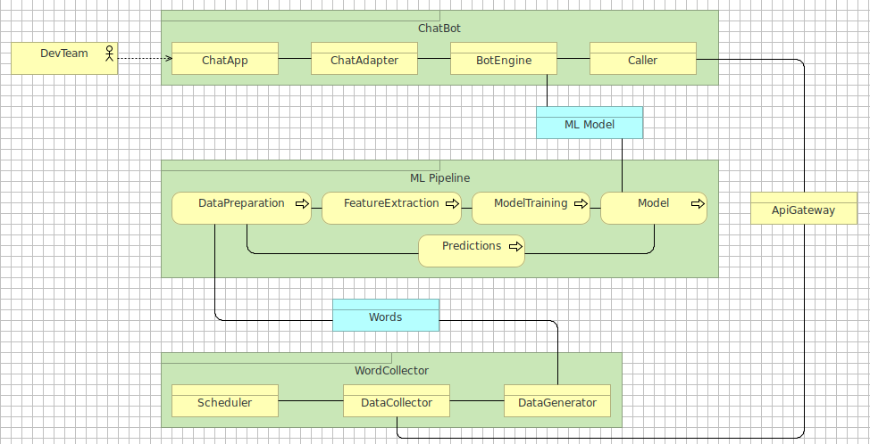

## 운영체제  

* Ubuntu 20.04.3 LTS

## 개발언어 

* Python 3.8.10

## Database

* MariaDB 10.4.21

## 주요 S/W Stack

> 상세 내용은 requirements.txt 참조

* aiomysql 0.0.21 (MariaDB 관련 비동기 라이브러리)
* alembic 1.6.5 (데이터 마이그레이션 도구)
* gunicorn 20.1.0 (웹 서버 게이트웨이 인터페이스)
* gensim 4.0.1 (단어 임베딩)
* Flask 2.0.0 (어플리케이션 프레임워크)
* keras 2.6.0 (딥러닝 모델 라이브러리)
* konlpy 0.5.2 (자연어 토크나이징, 형태소 분석)
* openpyxl 3.0.7 (엑셀 관련 라이브러리)
* pandas 1.3.2 (데이터 조작 및 분석 라이브러리)
* PyMySQL 0.9.3 (MariaDB 관련 라이브러리)
* pytest 6.2.4 (단위 테스트 프레임워크)
* sanic 21.3.4 (비동기 처리 어플리케이션 프레임워크)
* scikit-learn 0.24.2 (ML 라이브러리)
* SQLAlchemy 1.4.23 (ORM 라이브러리)
* tensorflow 2.6.0 (ML 프레임워크)
* aiohttp 3.8.0 (비동기 HTTP 서버/클라이언트 라이브러리)

## Source Directory

* CHATBOT_HOME
  * BotEngine
    * config
    * tests
    * app
  * WebChatbotAdapter 
    * app
      * adapter
      * static
      * templates
    * tests
  * MlPipeLine
    * train_tools
    * models
      * intent
      * ner
    * utils
    * config
    * tests
  * WordCollector
    * config
    * tests
    * app
  * TestRESTFulServer

# 구현 및 적용

## DB 테이블

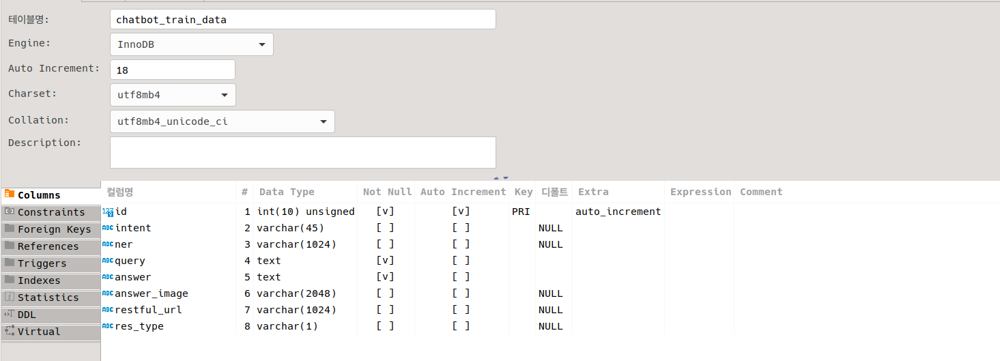

## 자연어 처리 과정

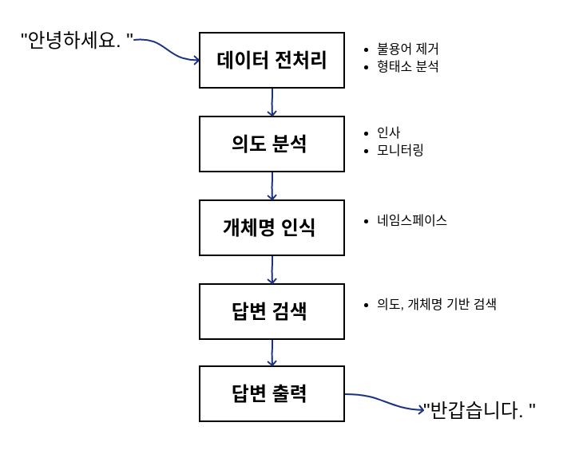

## ML Pipeline

### 형태소 분석

* 자연어 문장을 토큰(단어) 단위로 나누고(토크나이징) 형태소(어근, 접두사/접미사, 품사) 분석
* Konlpy에서 제공하는 Komoran(Korea Morphological Analyzer) 분석기 사용
* 사용자 사전 구축(tsv 포맷 사용, Tab으로 단어/품사 구분)
  * 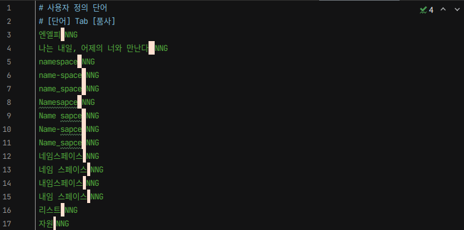

### 의도 분석

* 의도 종류: 인사, 욕설, 모니터링(네임스페이스)
* CNN(Convolutional Neural Network) 모델 사용
* Keras에서 제공하는 TensorFlow 사용
* 학습 모델 'intent_model.h5' 저장
* 정확도: 99.5%, 손실: 0.004%

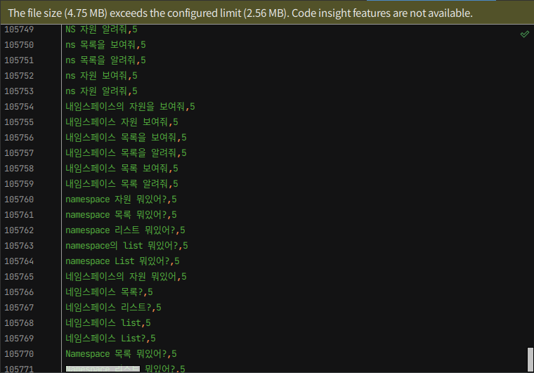
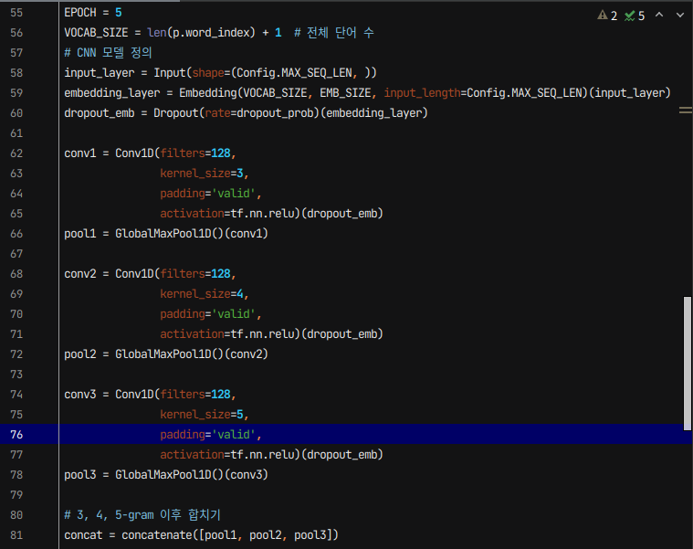
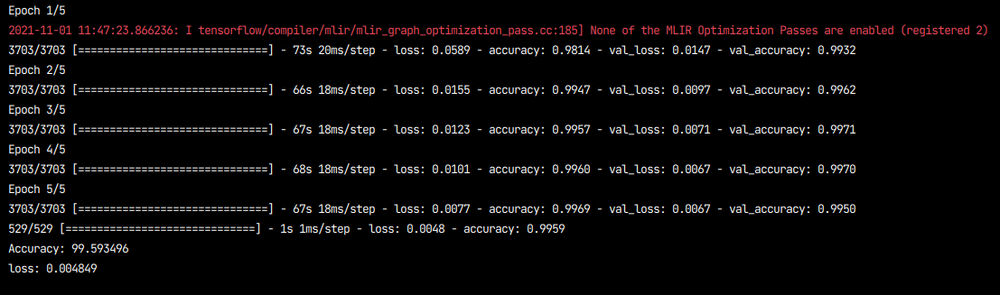

### 개체명 인식

* 양방향 LSTM(Long Short Term Memory) 모델 사용
  * 기존 LSTM 계층에 역방향 LSTM 계층을 추가해 양방향으로 문장의 패턴을 분석
  * 문장 길이가 길어도 정보 손실 없이 처리 가능
* F1 스코어(정밀도와 재현율 조화 평균): 96.3%

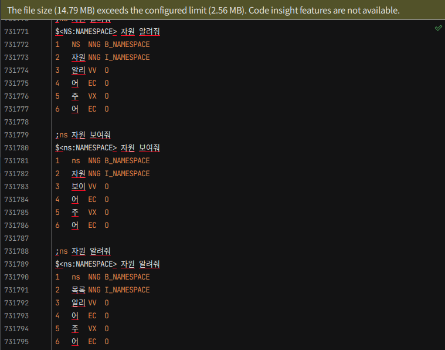
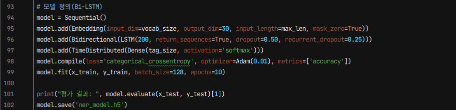
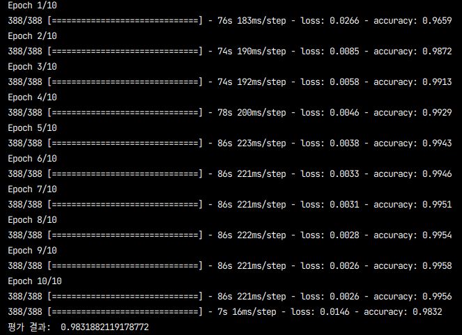
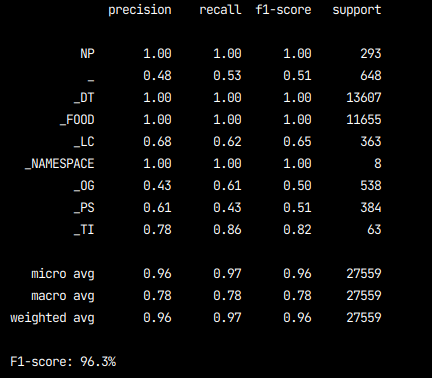

## ChatBot

### ChatApp

* Web 기반 챗봇
* Slack(예정)
* Facebook(예정)
* 카카오톡(예정)

### ChatAdapter

* Web 기반 챗봇
  * Flask

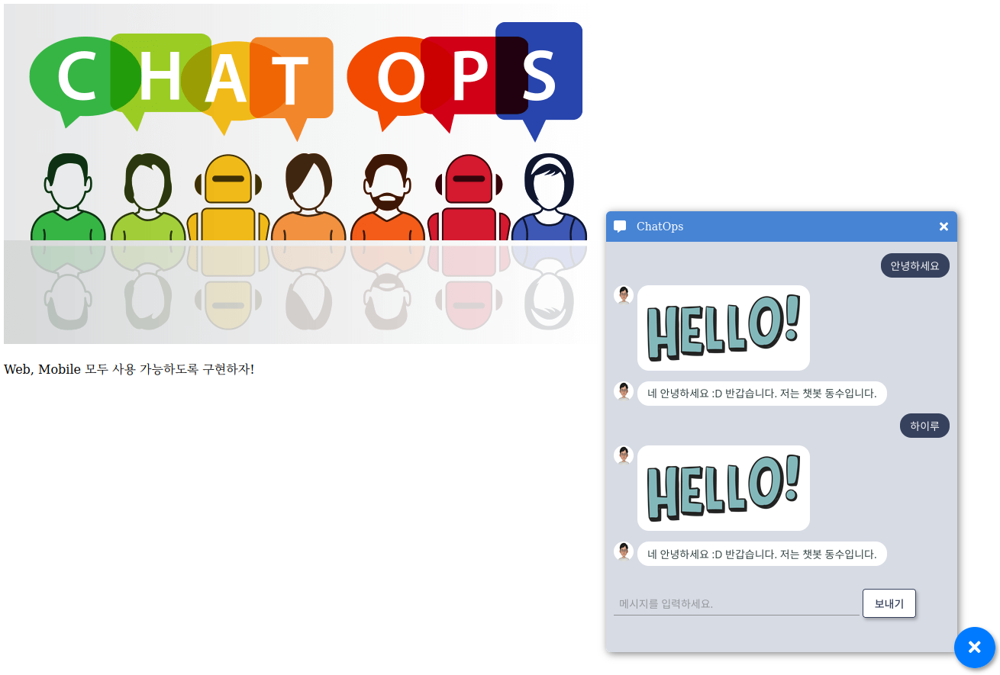

### BotEngine

* 분석된 의도와 개체명에 해당하는 답변을 DB에서 검색
  * 테이블명: chatbot_trian_data

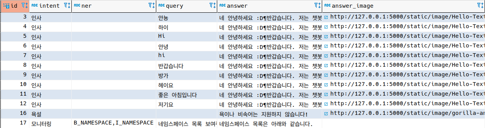

### Caller

* 모니터링(네임스페이스) RESTFul API 호출

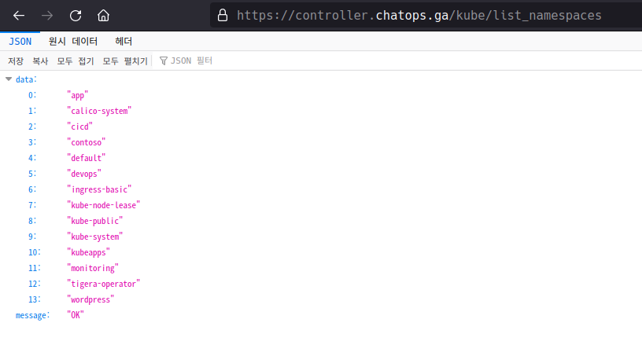

* 테스트를 위해 동일한 응답을 주는 Test RESTFul Server 사용

```shell
cd TestRESTFulServer
python aiohttp_test_server.py
```

# 시험 및 평가

## ML Pipeline

### 형태소 분석 

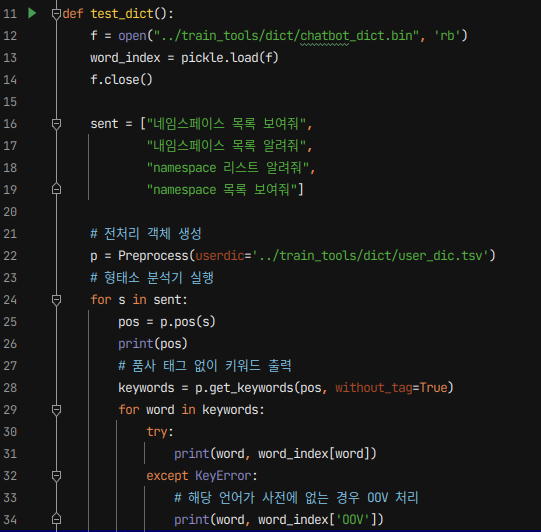
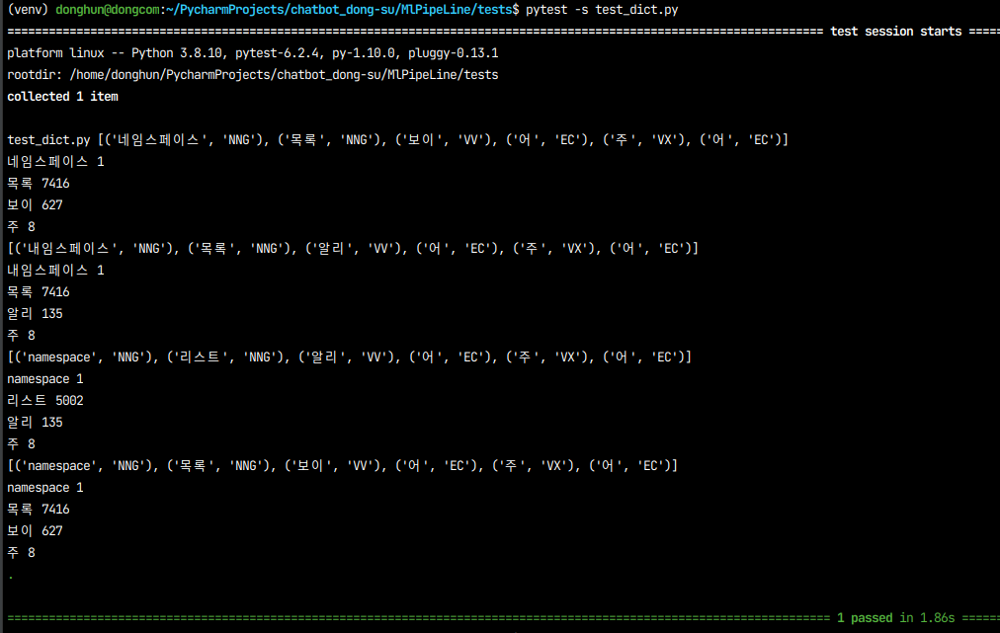

### 의도 분석

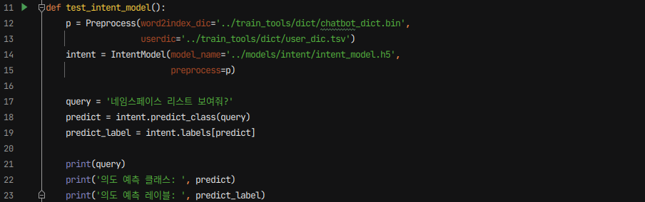
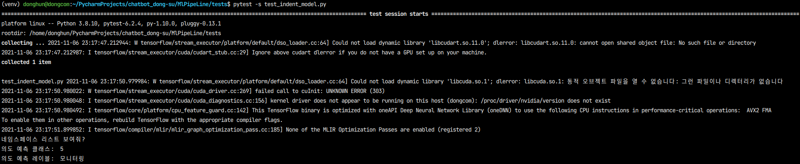

### 개체명 인식

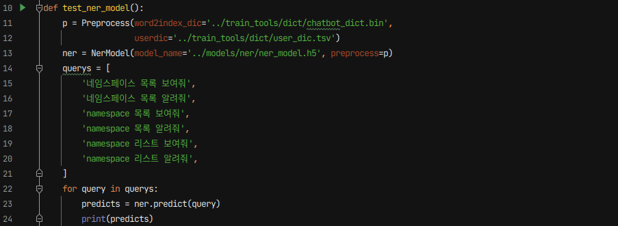
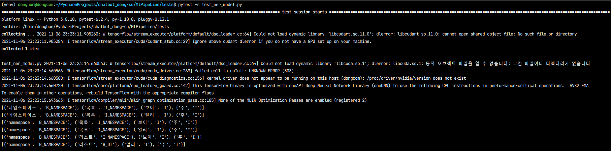

## ChatBot

### Test RESTFul Server 기동

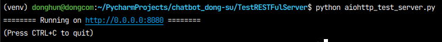

### ChatAdapter 기동

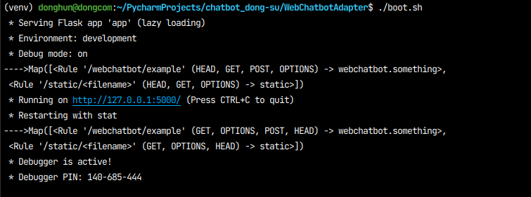

### BotEngine

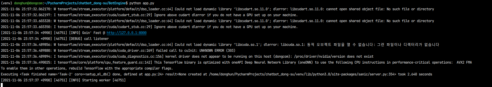

### 인사

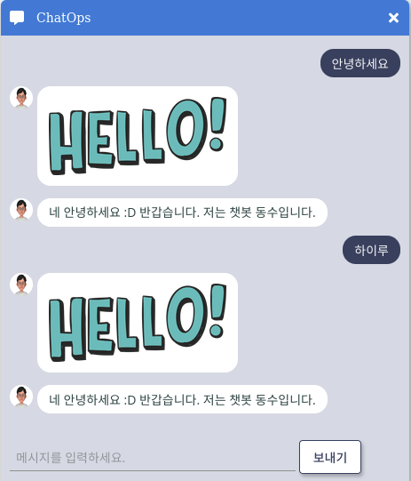
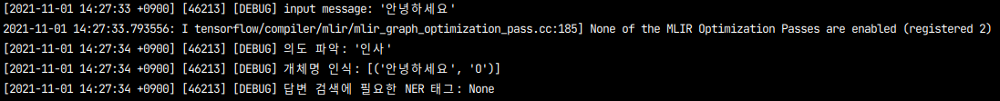
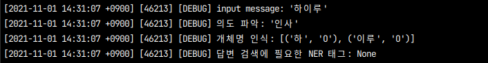

### 욕설 

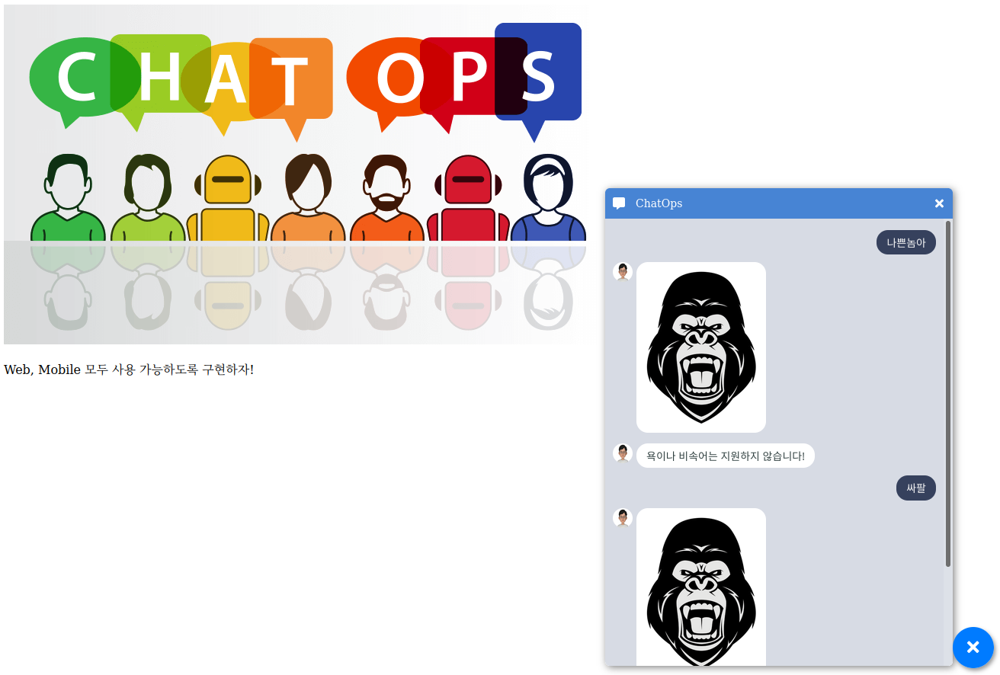
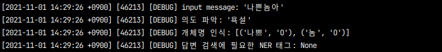

### 모니터링(네임스페이스)

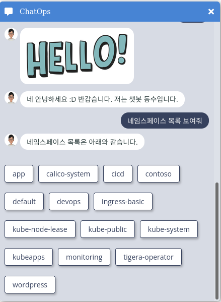
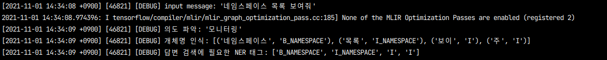
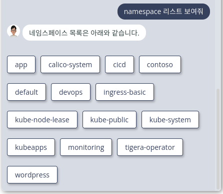
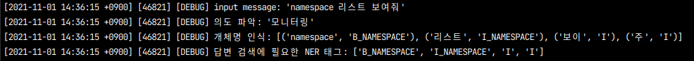
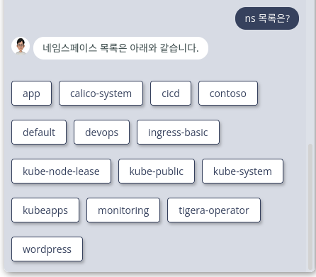
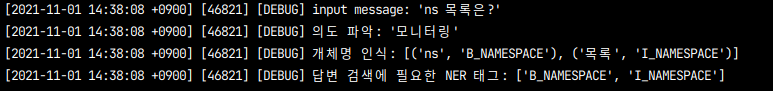

